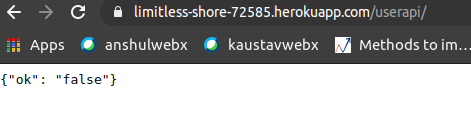
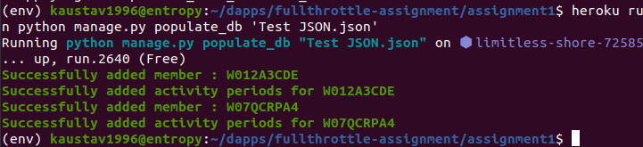
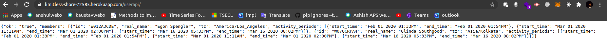
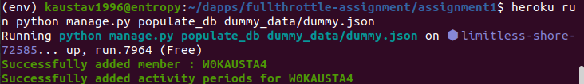

# Backend Test - FullThrottle Labs

## Objective

1. Design and implement a Django application with User and ActivityPeriod models.
2. Data format : [Test JSON.json](https://raw.githubusercontent.com/kaustav1996/fullthrottle_assignment1/master/Test%20JSON.json)
3. Write a custom management command to populate database with dummy data.
4. Host the API Endpoint in a publicly accessible location

## Solution

### Models
The problem statement requires creation of two models User and ActivityPeriod : [models.py](https://github.com/kaustav1996/fullthrottle_assignment1/blob/master/userapi/models.py).  
The [timezone_field](https://pypi.org/project/django-timezone-field/) module is used in the User Model for implementing TimeZone Field .

### Custom Management Command
Custom Management Command [populate_db](https://github.com/kaustav1996/fullthrottle_assignment1/blob/master/userapi/management/commands/populate_db.py) is developed to read data from a single/multiple JSON file(s) in the provided format and populate data into the DB. 

### View

View is created to return JsonResponse on request in the format provided : [views.py](https://github.com/kaustav1996/fullthrottle_assignment1/blob/master/userapi/views.py) . All users are queried and ordered by 'start_time' of activity periods.

### Deployment

Heroku is used to deploy the application . PostgreSQL database add on ( Hobby Dev plan) is used to store data

Live API End point : [https://limitless-shore-72585.herokuapp.com/userapi/](https://limitless-shore-72585.herokuapp.com/userapi/)

Pre Data Population

Populating Data

Post Populating Data

Populate Custom Data by pushing other JSON files in the server and then running the custom management command populate_db

Heroku Auto Deploy : 

